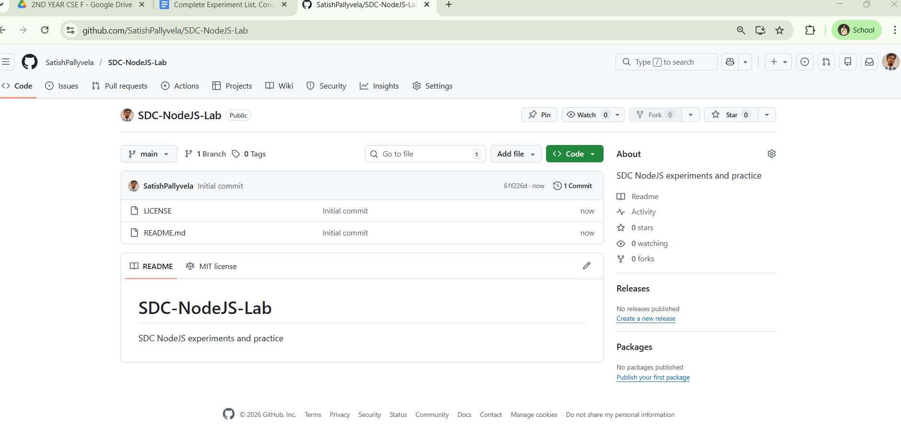
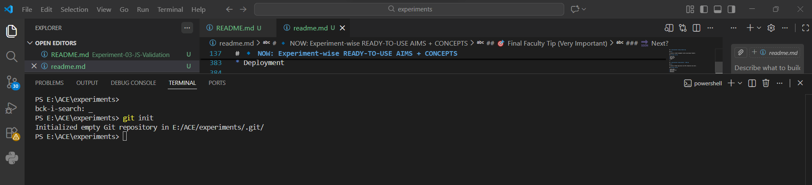
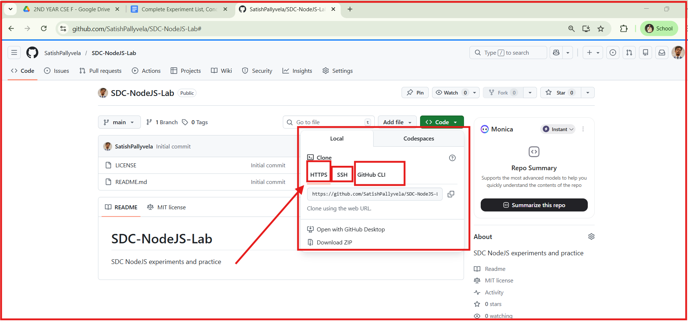

Perfect 👍
Now you’re at the **most important academic step**.
Let’s do this **cleanly, uniformly, and future-proof**.

Below is a **STANDARD README.md FORMAT for EACH experiment**, written in **simple English**, **record-ready**, **GitHub-ready**, and **student-friendly**.

You can:

* Copy this format into **all README.md files**
* Then customize **Aim / Code / Output** experiment-wise

---

# ✅ UNIVERSAL README.md FORMAT

*(Use this same structure for all 16 experiments)*

---

## 🔬 Experiment – XX

### **Experiment Title (As per Syllabus)**

---

## 📘 Course Information

* **Course Code:** CS409PC
* **Course Name:** NodeJS / ReactJS / Django
* **Program:** B.Tech – II Year II Semester
* **L T P C:** 0 0 2 1

---

## 🎯 Aim

(To be written clearly in 1–2 lines)

> The aim of this experiment is to …

---

## 📖 Introduction (Layman Explanation)

(3–4 simple sentences)

> This experiment helps us understand …
> In real-world applications, this is used for …
> This experiment forms the foundation for …

---

## 🧠 Concepts Covered

* Concept 1
* Concept 2
* Concept 3
* Concept 4

---

## 🛠 Tools / Software Used

* Visual Studio Code
* Web Browser (Chrome / Edge / Firefox)
* (Any framework / library if applicable)

---

## 🔄 Algorithm / Procedure

1. Step 1
2. Step 2
3. Step 3
4. Step 4

---

## 💻 Program Code

```text
(Add program files here or mention file names)
Example:
- index.html
- style.css
- script.js
```

*(Actual code files are stored in this folder)*

---

## 🖥 Output

(Describe output in words or attach screenshots)

> The output displays …

---

## 📝 Observation

```
In this experiment, we observed that …
We learned how …
The application behaved as expected when …
```

---

## ✅ Result

```
Thus, the experiment was successfully completed and the expected
output was obtained.
```

---

## 🎓 Learning Outcomes

After completing this experiment, the student is able to:

* Outcome 1
* Outcome 2
* Outcome 3

---

## 🔗 References

* [https://www.w3schools.com/](https://www.w3schools.com/)
* (Add experiment-specific links)

---

# 🔹 NOW: Experiment-wise READY-TO-USE AIMS + CONCEPTS

Below are **pre-filled Aim + Concepts** for **each experiment**
👉 You only paste into respective README.md

---

## 🧪 Experiment–1: HTML & CSS Shopping Cart

### Aim

To design a responsive shopping cart website using HTML and CSS.

### Concepts Covered

* HTML structure
        https://www.w3schools.com/html/html_intro.asp
        https://www.w3schools.com/html/html_basic.asp
        https://www.w3schools.com/html/html_elements.asp
        https://www.w3schools.com/html/html_attributes.asp
        https://www.w3schools.com/html/html_styles.asp
        https://www.w3schools.com/html/html_formatting.asp
        https://www.w3schools.com/html/html_links.asp
* Forms
        https://www.w3schools.com/css/css_form.asp
        https://www.w3schools.com/css/css_counters.asp
* CSS styling
            https://www.w3schools.com/css/css_intro.asp
            https://www.w3schools.com/css/css_syntax.asp
            https://www.w3schools.com/css/css_selectors.asp
            https://www.w3schools.com/css/css_selectors_grouping.asp
            

* Flexbox  
            https://www.w3schools.com/css/css3_flexbox.asp
            https://www.w3schools.com/css/css3_flexbox_container.asp
* Grid 
             https://www.w3schools.com/css/css_grid.asp
             https://www.w3schools.com/css/css_grid_tracks.asp
        
* Responsive design
            https://www.w3schools.com/css/css_rwd_intro.asp
            https://www.w3schools.com/css/css_rwd_viewport.asp
            https://www.w3schools.com/css/css_rwd_grid.asp
---


---

## 🧪 Experiment–4: ES6 + Weather API

### Aim

To explore ES6 features and fetch live weather data using OpenWeather API.

### Concepts Covered

* ES6 syntax
* Arrow functions
* Fetch API
* Promises
* async / await
* JSON

---

## 🧪 Experiment–5: JDBC CRUD Operations

### Aim

To develop a Java application that performs CRUD operations using JDBC.

### Concepts Covered

* JDBC architecture
* SQL queries
* Database connectivity
* CRUD operations

---

## 🧪 Experiment–6: XML with DTD & XSD

### Aim

To create and validate an XML document using DTD and XSD.

### Concepts Covered

* XML structure
* DTD
* XSD
* Validation

---

## 🧪 Experiment–7: Servlet Controller

### Aim

To design a servlet controller to interact with database-driven applications.

### Concepts Covered

* Servlets
* MVC architecture
* Request & Response
* JDBC integration

---

## 🧪 Experiment–8: Session Tracking

### Aim

To explore session tracking mechanisms in web applications.

### Concepts Covered

* Cookies
* HTTP Sessions
* URL rewriting

---

## 🧪 Experiment–9: Node.js Custom Server

### Aim

To create a custom server using Node.js core modules.

### Concepts Covered

* Node.js runtime
* HTTP module
* OS module
* Path module
* Events module

---

## 🧪 Experiment–10: Express REST API

### Aim

To develop RESTful APIs using Express framework.

### Concepts Covered

* Express
* REST architecture
* CRUD APIs
* Middleware

---

## 🧪 Experiment–11: JWT Authentication

### Aim

To secure REST APIs using JSON Web Tokens.

### Concepts Covered

* Authentication
* Authorization
* JWT
* Token-based security

---

## 🧪 Experiment–12: React Student Management App

### Aim

To develop a Single Page Application using React.

### Concepts Covered

* React components
* JSX
* Props
* State
* Routing

---

## 🧪 Experiment–13: React Weather App with Charts

### Aim

To display weather data graphically using React and Chart.js.

### Concepts Covered

* API calls
* Hooks
* Chart.js
* State management

---

## 🧪 Experiment–14: React TODO App

### Aim

To develop a TODO application using React and deploy it on GitHub.

### Concepts Covered

* Components
* Hooks
* CRUD operations
* Deployment

---

## 🧪 Experiment–15: Django Student App

### Aim

To develop a student management system using Django framework.

### Concepts Covered

* Django MVT
* URL routing
* Templates
* Forms

---

## 🧪 Experiment–16: Django Weather / TODO App

### Aim

To develop a Django application with API integration and charts.

### Concepts Covered

* Django ORM
* API integration
* Chart.js
* Deployment

---

## 🎯 Final Faculty Tip (Very Important)

Tell students:

> “README.md is your **record book**,
> Code files are your **practical notebook**.”

---

### 🔜 Next?

I can:

* Auto-fill **Observations for all experiments**
* Create **viva questions**
* Prepare **lab evaluation rubric**
* Generate **student GitHub instructions**
* Help you commit everything cleanly

Just say 👍


==============================================================================================
ABOUT SYNCING THE GITHUB 


INITIALLY ON GITHUB AFTER CREATION REPOSITORY


COPY THE URL OF YOUR USERNAME , REPOSITORY LINK FROM YOUR GITHUB ACCOUNT



# 🔗 HTTPS vs SSH vs GitHub CLI (IN SIMPLE WORDS)

When you connect your **local system to GitHub**, GitHub gives **3 ways**.

---

## 1️⃣ HTTPS (⭐ BEST FOR BEGINNERS)

👉 **Use THIS**

Example:

```
https://github.com/username/SDC-NodeJS-Lab.git
```

### What it means:

* Like logging into Gmail using **username + password**
* GitHub opens browser and asks you to **authorize**

### Why use HTTPS?

✔ Easiest
✔ No setup
✔ Best for students & labs

📌 **Recommended for SDC / college labs**

---

## 2️⃣ SSH (For Advanced Users)

Example:

```
git@github.com:username/SDC-NodeJS-Lab.git
```

### What it means:

* Uses **key-based login** (no password)
* Requires:

  * SSH key generation
  * GitHub setup

### Why NOT for beginners?

❌ Confusing
❌ Extra setup
❌ Errors common in labs

👉 **Not recommended for students now**

---

## 3️⃣ GitHub CLI (Advanced Tool)

Example:

```bash
gh repo clone username/SDC-NodeJS-Lab
```

### What it means:

* Command-line app by GitHub
* Requires installation & login

👉 Useful for professionals, **not needed for labs**

---

## 🏆 FINAL SIMPLE RULE (TELL STUDENTS)

> “Always copy **HTTPS URL**. Ignore SSH and CLI.”

---

## 📌 One-Line Explanation You Can Say in Class

> “HTTPS is simple browser-based login. SSH and CLI are advanced and we don’t use them now.”

---

## ✅ What YOU Should Do Now

1. Copy **HTTPS URL**
2. Use:

```powershell
git remote add origin https://github.com/your-username/SDC-NodeJS-Lab.git
```

=====================================================================================================
